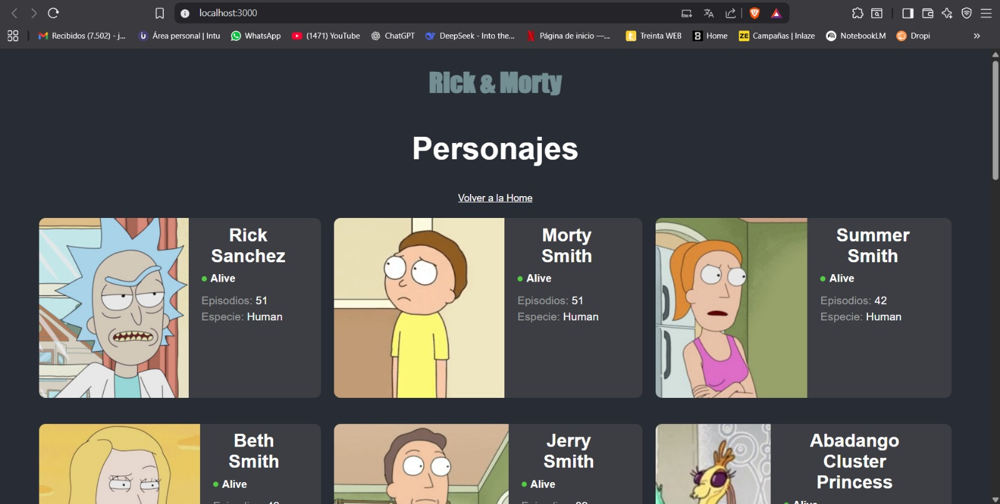

# Docker Test - Informe del Taller

## Estudiante: Juan Felipe Jojoa Crespo - A00382042

## 1. Fork del repositorio

Se realizó un fork del repositorio original [ChristianFlor/docker-test](https://github.com/ChristianFlor/docker-test) hacia la cuenta personal [`JuanJojoa7/docker-test`](https://github.com/JuanJojoa7/docker-test). Esto permite trabajar con una copia propia y configurar workflows sin afectar el proyecto base.

## 2. Creación del Dockerfile

En la raíz del proyecto se creó un archivo `Dockerfile` con el siguiente contenido, para construir la aplicación React y servirla con Nginx:

```dockerfile
# Imagen base de Node.js
FROM node:18-alpine as build

# Definir directorio de trabajo
WORKDIR /app

# Copiar dependencias y archivos
COPY package.json yarn.lock ./
RUN yarn install

# Copiar el resto del código
COPY . .

# Construir la app de producción
RUN yarn build

# Etapa final: servir con un servidor liviano
FROM nginx:alpine
COPY --from=build /app/build /usr/share/nginx/html

EXPOSE 80
CMD ["nginx", "-g", "daemon off;"]
```

Este archivo se encarga de compilar el proyecto y luego exponerlo a través de Nginx en el puerto 80.

## 3. Configuración de secretos en GitHub

En el repositorio fork se configuraron los secretos necesarios para que GitHub Actions pueda autenticarse en Docker Hub:

* `DOCKER_USERNAME`: nombre de usuario de Docker Hub.
* `DOCKER_PASSWORD`: token de acceso personal generado desde Docker Hub, con permisos de lectura y escritura.

Estos secretos se añadieron en **Settings → Secrets and variables → Actions → New repository secret**.

## 4. Creación del workflow de GitHub Actions

Se creó la carpeta `.github/workflows` y dentro de ella el archivo `docker-publish.yml` con el siguiente contenido:

```yaml
name: Build and Push Docker Image

on:
  push:
    branches: ["main"]
  workflow_dispatch:

jobs:
  docker:
    runs-on: ubuntu-latest

    steps:
      - name: Checkout repository
        uses: actions/checkout@v3

      - name: Set up Docker Buildx
        uses: docker/setup-buildx-action@v3

      - name: Log in to Docker Hub
        uses: docker/login-action@v3
        with:
          username: ${{ secrets.DOCKER_USERNAME }}
          password: ${{ secrets.DOCKER_PASSWORD }}

      - name: Build and Push Docker image
        uses: docker/build-push-action@v5
        with:
          context: .
          push: true
          tags: juanjojoa7/docker-test:latest
```

Este workflow construye la imagen a partir del `Dockerfile` y la publica en Docker Hub bajo el nombre `juanjojoa7/docker-test:latest`.

## 5. Ejecución del workflow

Se realizó un commit en la rama `main`.
Al activarse el workflow, este construyó la imagen y la publicó correctamente en Docker Hub.

## 6. Pruebas locales


Para validar el funcionamiento de la imagen, se descargó y ejecutó localmente:

```bash
docker pull juanjojoa7/docker-test:latest
docker run -p 3000:80 juanjojoa7/docker-test:latest
```

La aplicación quedó accesible en `http://localhost:3000`.


## Aplicacion Funcionando de personajes de Rick y Morty




## 7. Limpieza de contenedores

Después de las pruebas, se detuvo y eliminó el contenedor:

```bash
docker ps -a                # Verificar contenedores
docker stop <container_id>  # Detenerlo en caso de estar activo
docker rm <container_id>    # Eliminarlo
```

En caso de querer liberar aún más espacio, también se puede eliminar la imagen local:

```bash
docker rmi juanjojoa7/docker-test:latest
```

## Conclusiones

El taller permitió comprender el flujo completo de integración entre un proyecto de aplicación web, su construcción en un contenedor Docker y la publicación automatizada mediante GitHub Actions en Docker Hub.

La configuración de secretos y el uso de workflows permitió asegurar las credenciales y garantizar la automatización del proceso. La aplicación pudo desplegarse y validarse correctamente en un entorno local.

# Getting Started with Create React App

This project was bootstrapped with [Create React App](https://github.com/facebook/create-react-app).
hi

## Available Scripts

In the project directory, you can run:

### `npm start`

Runs the app in the development mode.\
Open [http://localhost:3000](http://localhost:3000) to view it in your browser.

The page will reload when you make changes.\
You may also see any lint errors in the console.

### `npm test`

Launches the test runner in the interactive watch mode.\
See the section about [running tests](https://facebook.github.io/create-react-app/docs/running-tests) for more information.

### `npm run build`

Builds the app for production to the `build` folder.\
It correctly bundles React in production mode and optimizes the build for the best performance.

The build is minified and the filenames include the hashes.\
Your app is ready to be deployed!

See the section about [deployment](https://facebook.github.io/create-react-app/docs/deployment) for more information.

### `npm run eject`

**Note: this is a one-way operation. Once you `eject`, you can't go back!**

If you aren't satisfied with the build tool and configuration choices, you can `eject` at any time. This command will remove the single build dependency from your project.

Instead, it will copy all the configuration files and the transitive dependencies (webpack, Babel, ESLint, etc) right into your project so you have full control over them. All of the commands except `eject` will still work, but they will point to the copied scripts so you can tweak them. At this point you're on your own.

You don't have to ever use `eject`. The curated feature set is suitable for small and middle deployments, and you shouldn't feel obligated to use this feature. However we understand that this tool wouldn't be useful if you couldn't customize it when you are ready for it.

## Learn More

You can learn more in the [Create React App documentation](https://facebook.github.io/create-react-app/docs/getting-started).

To learn React, check out the [React documentation](https://reactjs.org/).

### Code Splitting

This section has moved here: [https://facebook.github.io/create-react-app/docs/code-splitting](https://facebook.github.io/create-react-app/docs/code-splitting)

### Analyzing the Bundle Size

This section has moved here: [https://facebook.github.io/create-react-app/docs/analyzing-the-bundle-size](https://facebook.github.io/create-react-app/docs/analyzing-the-bundle-size)

### Making a Progressive Web App

This section has moved here: [https://facebook.github.io/create-react-app/docs/making-a-progressive-web-app](https://facebook.github.io/create-react-app/docs/making-a-progressive-web-app)

### Advanced Configuration

This section has moved here: [https://facebook.github.io/create-react-app/docs/advanced-configuration](https://facebook.github.io/create-react-app/docs/advanced-configuration)

### Deployment

This section has moved here: [https://facebook.github.io/create-react-app/docs/deployment](https://facebook.github.io/create-react-app/docs/deployment)

### `npm run build` fails to minify

This section has moved here: [https://facebook.github.io/create-react-app/docs/troubleshooting#npm-run-build-fails-to-minify](https://facebook.github.io/create-react-app/docs/troubleshooting#npm-run-build-fails-to-minify)
